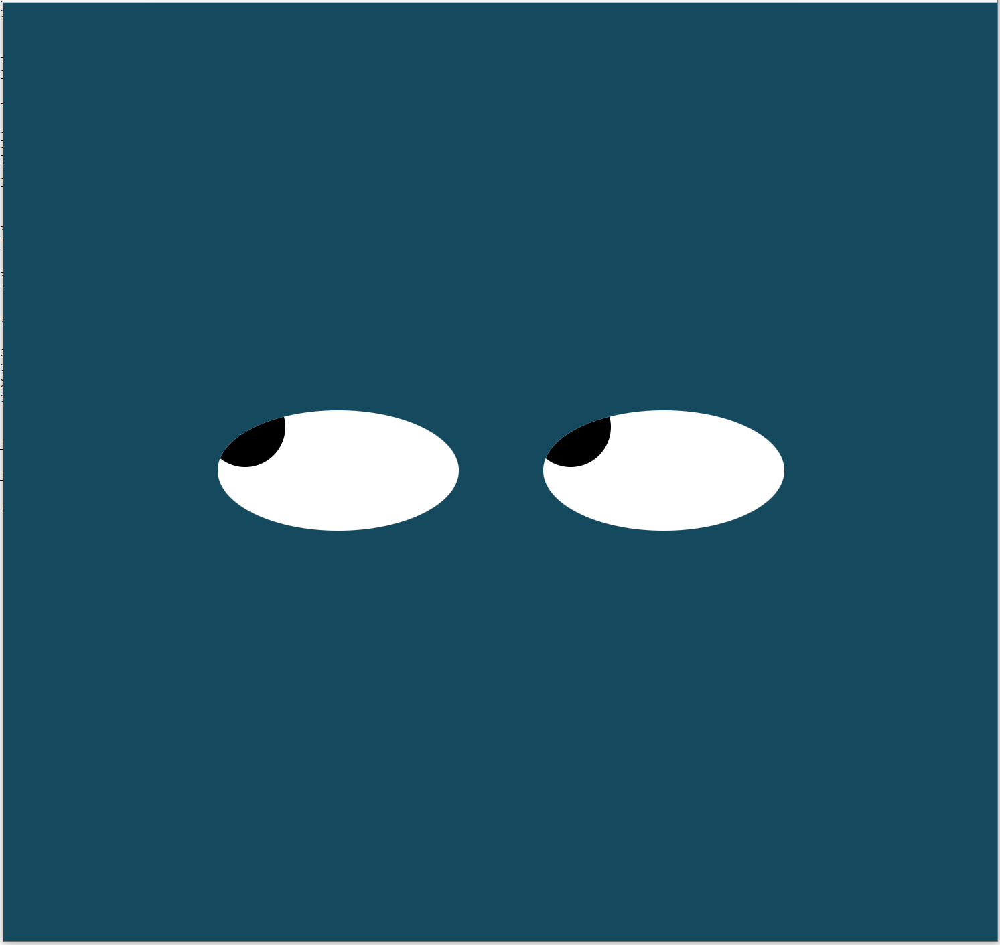

# EyePairMovement

### **Description**: Week 08: Pair of Eyes Movement Tracking Computer Mouse-Cursor Movements on Computer Monitor Window

Demonstrate web application using JavaScript, HTML, and CSS to move the pair of eyes:

<ul>
  <li>HTML: div element</li>
  <li>Stylesheet: class</li>
  <li>JavaScript:</li>
    <ul>
      <li>using document.onmousemove()</li>
      <li>manipulating the <b>div</b> tag style attributes</li>
      <li>using array</li>
      <li>using for() loop</li>
      <li>using window.innerHeight property</li>
    </ul>
  </li>
</ul>

### **Installation**:
<ul><li>Fork the repository</li></ul>

### **Usage**:
<ul>
	<li>Load index.html on your internet browser</li>
	<li>Mouse your computer mouse cursor inside your browser window</li>
	<li>To stop the animation, close your internet browser</li>
</ul>

### **Support**:
<ul><li>None.</li></ul>

### **Roadmap**:
<ul><li>None.</li></ul>

### **License information**:
<ul>
  <li>Some provided materials from the lecture videos and from assignment solutions are used in this project</li>
  <li>Some implementations are derived from the provided materials of the course:
    <ul>
      <li>index.html</li>
      <li>styles.css</li>
    </ul>
  </li>
</ul>
